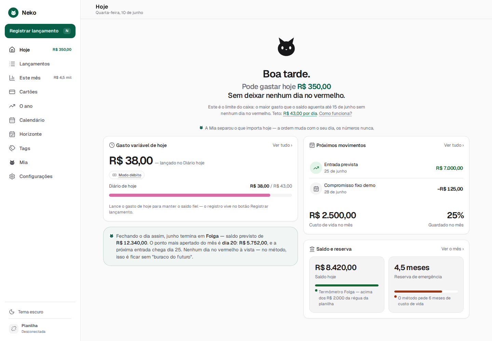
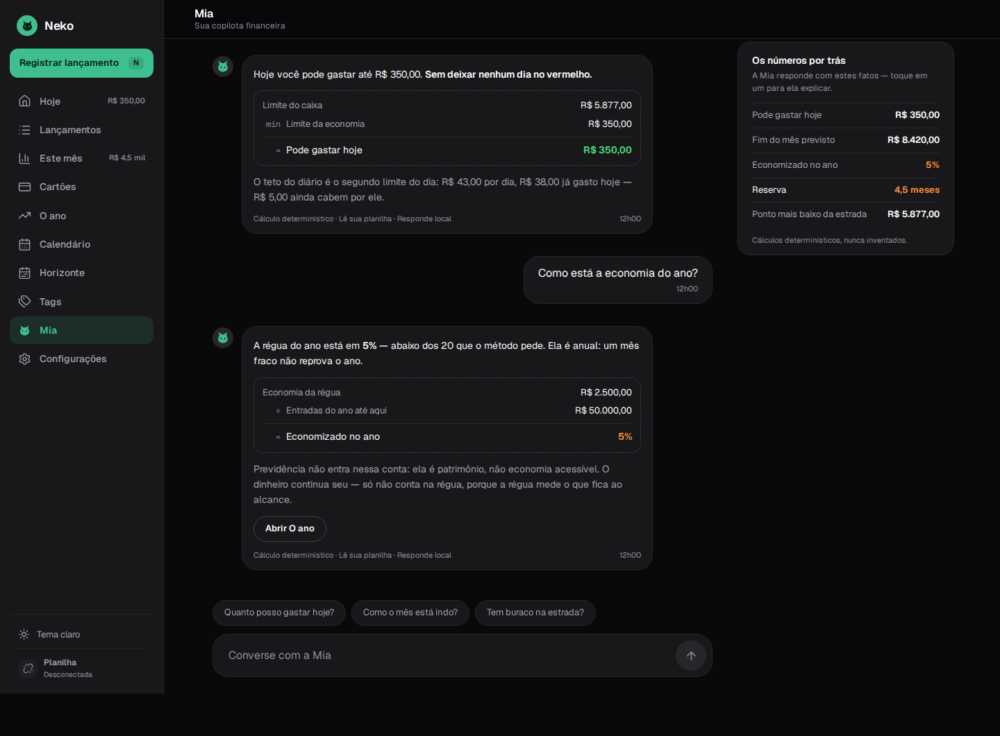
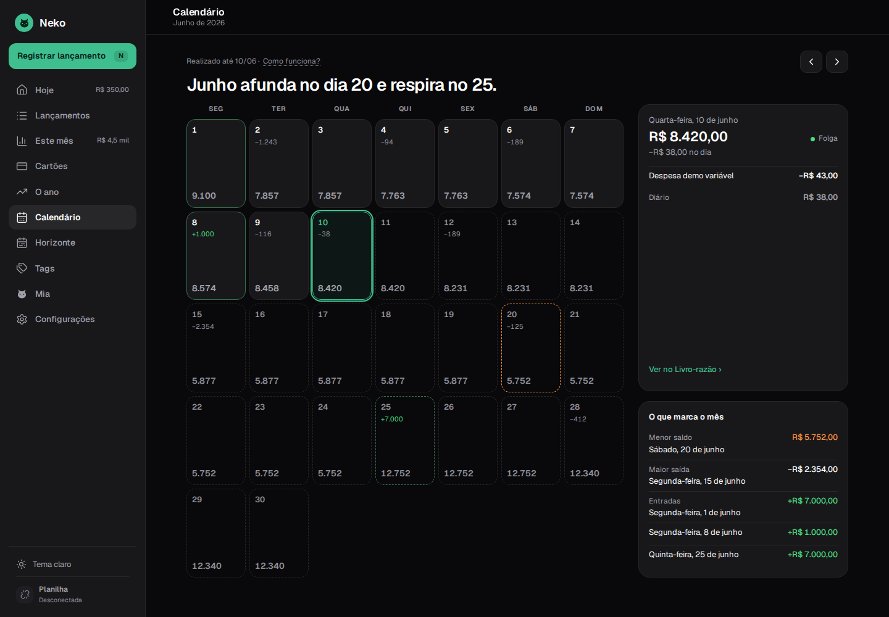
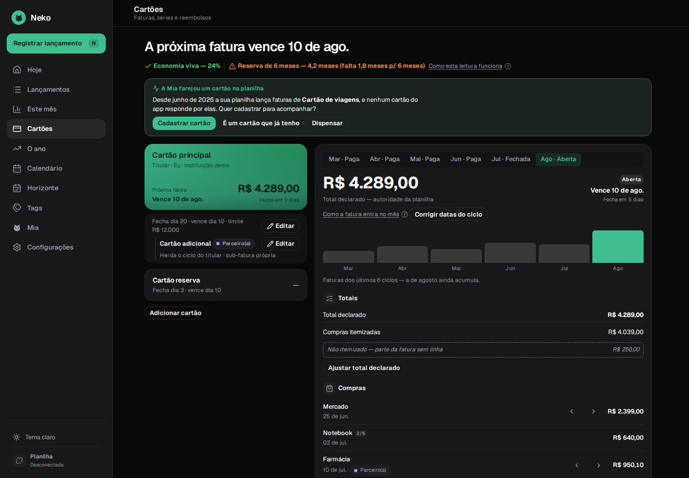

# Neko Finance

[](https://github.com/johnlaff/NekoFinance/actions/workflows/ci.yml)
[](https://github.com/johnlaff/NekoFinance/actions/workflows/codeql.yml)
[](https://github.com/johnlaff/NekoFinance/actions/workflows/security.yml)
[](https://github.com/johnlaff/NekoFinance/actions/workflows/release.yml)

Neko Finance is a **local-first desktop app** for forecast-first personal finance: a Google
Sheets-connected dashboard with a deterministic projection engine and an AI copilot, Mia. Built
with Tauri 2 + React 19 + Rust.

Three engineering commitments shape everything here:

- **The math is deterministic.** A pure, TDD'd Rust engine answers "how does the month end?" —
  no LLM ever does financial arithmetic; Mia explains numbers the engine computed, with an
  auditable receipt per answer.
- **One reading, many slices.** Every screen, DTO, and copilot tool derives from a single
  composed reading of the day (`ForecastReading`) — a different window never means a different
  derivation ([ADR-0005](docs/adr/0005-single-annual-ruler-patrimonio-outside.md)).
- **Boundaries are enforced, not suggested.** Screens consume view modules only; the direct
  `lib/api` path is closed by lint with a zeroed allowlist
  ([ADR-0011](docs/adr/0011-lib-api-funnel-closed.md)).

The repo is public and **data-free by design**: no private methodology source material, OAuth
tokens, spreadsheet data, or personal finance caches are committed — see Privacy Rules below.

<picture>
  <source media="(prefers-color-scheme: dark)" srcset="docs/screenshots/hoje-dark.png">
  
</picture>

## What it does

- **Projected running balance** — the engine chains income/outflow events day by day; the
  dashboard hero is "pode gastar hoje R$ X" (safe-to-spend), with the month-end verdict and an
  explicit warning when any future day dips negative.
- **Twelve navigable screens** — Hoje, Lançamentos (ledger with cell×note citations), Este mês,
  Cartões (invoices, cycles, partner card and refunds), O ano (the annual savings ruler),
  Calendário, Horizonte (multi-month runway), Tags (per-ruler switches), Teto do diário, Mia,
  Configurações, plus the scenario planner.
- **Mia, the copilot** — offline she answers locally from deterministic state tools; connected,
  an agent loop runs over the same read facade. Every answer carries the formula receipt shown
  below; the transcript persists locally and can be truly deleted.
- **Google Sheets, both ways** — OAuth (PKCE, loopback) import with layout detection and
  deduplication, or a local `.xlsx` with no account; write-back only through a structured
  before→after diff with explicit human approval.
- **Local SQLite store** (WAL) — the system of record; the spreadsheet stays a human-friendly
  projection kept in sync by import + approved write-back
  ([ADR-0003](docs/adr/0003-sqlite-system-of-record-collapsed-writeback.md)).

| Mia's auditable receipt                                                  | The month, day by day                                                                        | Cards and cycles                                                                 |
| ------------------------------------------------------------------------ | -------------------------------------------------------------------------------------------- | -------------------------------------------------------------------------------- |
|  |  |  |

## Stack

- Tauri 2 desktop shell, Rust (edition 2024), sqlx/SQLite
- React 19 + TypeScript (strict) + Vite
- "Midnight Purr" design system (dark-first, WCAG AA, configurable brand accent) — `src/design-system/`
- Quality: ESLint (type-checked + React Compiler rules), Prettier, vitest (90% coverage
  thresholds), Playwright visual smoke with aria snapshots, clippy `-D warnings`, rustfmt,
  gitleaks privacy scan, React Doctor

See `docs/version-matrix.md` for version decisions.

## Install

Grab the latest build from [Releases](https://github.com/johnlaff/NekoFinance/releases):
`*-setup.exe` (Windows installer), the portable single-file `*.exe`, or the Linux
`.deb`/`.AppImage`/`.rpm`. Every artifact ships with SLSA provenance — verify with
`gh attestation verify <file> --repo johnlaff/NekoFinance`.

## Developing

```bash
npm ci
npm run tauri dev      # desktop app (requires Tauri prerequisites below)
npm run check          # full local gate: format, lint, types, tests, build, rust, privacy
```

Linux/WSL2 prerequisites for the desktop shell:

```bash
sudo apt update
sudo apt install libwebkit2gtk-4.1-dev build-essential curl wget file libxdo-dev \
  libssl-dev libayatana-appindicator3-dev librsvg2-dev libdbus-1-dev pkg-config \
  patchelf
```

Optional: connect Google Sheets by setting `VITE_GOOGLE_CLIENT_ID` **and**
`VITE_GOOGLE_DESKTOP_CLIENT_KEY` in `.env` (see `.env.example`). That second value — the
desktop-client credential Google issues, not confidential by its own definition — is required for
background token refresh: with only the client ID, the Google connection drops when the first
access token expires (~1 hour). Without either, the local `.xlsx` import path works out of the box.

### Windows build

`npm run build:windows` cross-compiles a **single-file portable** `neko-finance.exe` from
Linux/WSL2 (MSVC target via cargo-xwin; WebView2 loader and VC runtime statically linked).
Tagged releases build the NSIS/MSI installers plus the portable exe in CI.
Details: `docs/building-windows.md`.

## Engineering highlights

- **Spec-driven development** — every non-trivial slice starts under `specs/<n>-<slug>/`
  (spec → plan → tasks → implement → verify); the tree carries 39 of them. Constitution:
  `.specify/memory/constitution.md`.
- **Functional core, imperative shell** — finance math lives in pure Rust modules
  (`src-tauri/src/reading/`, `src-tauri/src/forecast/`) with no IO; Tauri commands are thin,
  tested adapters. TDD is mandatory for finance math.
- **Cross-language parity by fixture** — the card-cycle boundary rule runs against the same
  JSON fixture in Rust and TypeScript (`fixtures/card-cycle-parity.json`), so the two sides
  cannot drift apart silently.
- **Decisions on the record** — 11 ADRs in `docs/adr/` cover the load-bearing choices, from
  SQLite as system of record to the closed lib/api funnel.
- Domain vocabulary: `CONTEXT.md`. Agent instructions: `AGENTS.md` (root and `src-tauri/`).

## Privacy Rules

- Keep raw source material, transcripts, embeddings, OAuth tokens, and financial data out of git.
- Keep methodology packs local and gitignored (`.methodology-pack/`).
- Use only anonymized, source-neutral methodology rules in public docs and code.
- Keep `.private-forbidden-patterns` local for private names/domains; `npm run privacy:scan`
  enforces it.

## Docs

- `docs/architecture.md` — MVP architecture and implementation slices
- `docs/engineering-standards.md` — coding standards, SDD workflow, quality gates
- `docs/building-windows.md` — Windows .exe builds (CI + local cross-compile)
- `docs/ai-development.md` — agent-ready workflow and product AI guardrails
- `docs/testing-strategy.md` — coverage, Playwright, React Doctor, eval policy
- `docs/release-and-distribution.md` — release train and updater plan
- `docs/methodology-pack.md` — private methodology pack contract
- `specs/` — feature specs, plans, and task breakdowns
