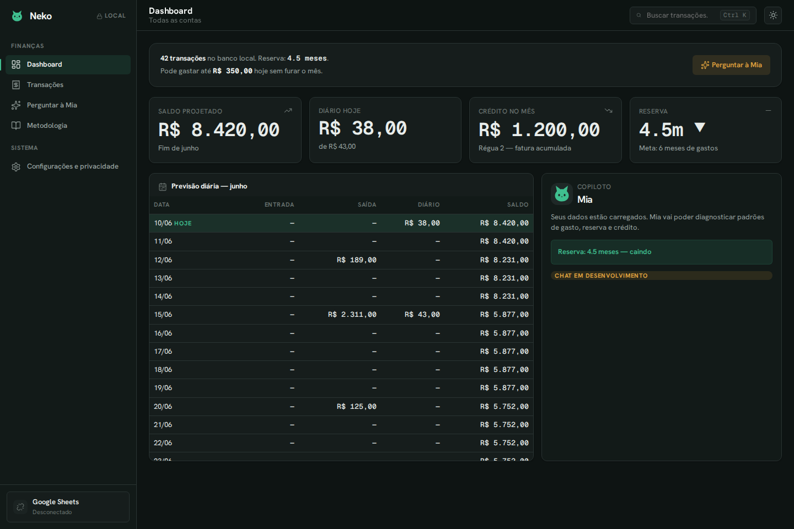

# Neko Finance

[](https://github.com/johnlaff/NekoFinance/actions/workflows/ci.yml)
[](https://github.com/johnlaff/NekoFinance/actions/workflows/codeql.yml)
[](https://github.com/johnlaff/NekoFinance/actions/workflows/security.yml)
[](https://github.com/johnlaff/NekoFinance/actions/workflows/release.yml)

Neko Finance is a **local-first desktop app** for forecast-first personal finance: a Google
Sheets-connected dashboard with a deterministic projection engine and an AI copilot (Mia, in
development). Built with Tauri 2 + React 19 + Rust.

The repo is public and **data-free by design**: no private methodology source material, OAuth
tokens, spreadsheet data, or personal finance caches are committed — see Privacy Rules below.



## What it does today (v0.1)

- **Projected running balance** — a pure, TDD'd Rust engine chains income/outflow events day by
  day and answers the question that matters: _how does the month end?_ The dashboard hero is the
  projected end-of-month balance, plus "pode gastar até X hoje" (safe-to-spend) and an explicit
  warning when any future day dips negative.
- **Monthly ledger** — Data / Entrada / Saída / Diário / Saldo for any selected month (past or
  future), today highlighted, a saldo thermometer, and a footer (Entradas / Saídas / Diário →
  Saída Total → Performance); dual credit tracking (débito hits the day; credit accumulates and lands on
  the invoice due date).
- **Google Sheets import** — OAuth (PKCE, loopback) + month-block layout detection, column
  mapping review, deduplicated imports. Or import a local `.xlsx` copy without any Google account.
- **Nine navigable screens** — Hoje (dashboard), Lançamentos (filter + search), Este mês (Totais),
  O ano (Anual), Calendário (monthly day-by-day grid), Horizonte (multi-month), Tags, Mia (chat: six
  deterministic local answers offline; with the conversation linked, an agent loop over the read
  facade — the transcript persists locally and can be truly deleted), and Configurações
  (connections, local import, where-your-data-lives).
- **Local SQLite store** (WAL) — 53 migrations: accounts/pockets + liquidity, transactions/splits,
  tags, recurrence, reserve tracking + snapshots, sheet layouts + note line-item classification,
  three-way-merge reconciliation, sync log, conversation store (transcript, 30-day technical
  trace, durable proposal ledger). FTS5 was added then removed (never populated; search is
  client-side). SQLite is the system of record; the spreadsheet stays a human-friendly projection
  kept in sync by import + approved write-back (see `docs/adr/0003-sqlite-system-of-record-collapsed-writeback.md`).

## Stack

- Tauri 2 desktop shell, Rust 1.96 (edition 2024), sqlx/SQLite
- React 19 + TypeScript (strict) + Vite 8
- "Midnight Purr" design system (dark-first, WCAG AA, configurable brand accent) — `src/design-system/`
- Quality: ESLint, Prettier, vitest (90% coverage thresholds), Playwright smoke, clippy
  `-D warnings`, rustfmt, gitleaks privacy scan, React Doctor

See `docs/version-matrix.md` for version decisions.

## Install

Grab the latest build from [Releases](https://github.com/johnlaff/NekoFinance/releases):
`*-setup.exe` (Windows installer), the portable single-file `*.exe`, or the Linux
`.deb`/`.AppImage`/`.rpm`. Every artifact ships with SLSA provenance — verify with
`gh attestation verify <file> --repo johnlaff/NekoFinance`.

## Developing

```bash
npm ci
npm run tauri dev      # desktop app (requires Tauri prerequisites below)
npm run check          # full local gate: format, lint, types, tests, build, rust, privacy
```

Linux/WSL2 prerequisites for the desktop shell:

```bash
sudo apt update
sudo apt install libwebkit2gtk-4.1-dev build-essential curl wget file libxdo-dev \
  libssl-dev libayatana-appindicator3-dev librsvg2-dev libdbus-1-dev pkg-config \
  patchelf
```

Optional: connect Google Sheets by setting `VITE_GOOGLE_CLIENT_ID` **and**
`VITE_GOOGLE_DESKTOP_CLIENT_KEY` in `.env` (see `.env.example`). That second value — the
desktop-client credential Google issues, not confidential by its own definition — is required for
background token refresh: with only the client ID, the Google connection drops when the first
access token expires (~1 hour). Without either, the local `.xlsx` import path works out of the box.

### Windows build

`npm run build:windows` cross-compiles a **single-file portable** `neko-finance.exe` from
Linux/WSL2 (MSVC target via cargo-xwin; WebView2 loader and VC runtime statically linked).
Tagged releases build the NSIS/MSI installers plus the portable exe in CI.
Details: `docs/building-windows.md`.

## Engineering approach

- **Spec-driven development**: every non-trivial slice starts under `specs/<n>-<slug>/`
  (spec → plan → tasks → implement → verify). Constitution: `.specify/memory/constitution.md`.
- **Functional core, imperative shell**: finance math lives in pure Rust modules
  (`src-tauri/src/forecast/`) with no IO; Tauri commands are thin, tested adapters.
- **TDD is mandatory for finance math** — and no LLM ever does financial arithmetic; the copilot
  will explain numbers the deterministic engine computed.
- **Human-approved writes**: every write back to Google Sheets requires a structured before→after
  diff, explicit approval, and a second confirmation before sending; formula and anchor columns
  are blocked by design.
- Domain vocabulary: `CONTEXT.md`. Decisions: `docs/adr/`. Agent instructions: `AGENTS.md`.

## Privacy Rules

- Keep raw source material, transcripts, embeddings, OAuth tokens, and financial data out of git.
- Keep methodology packs local and gitignored (`.methodology-pack/`).
- Use only anonymized, source-neutral methodology rules in public docs and code.
- Keep `.private-forbidden-patterns` local for private names/domains; `npm run privacy:scan`
  enforces it.

## Docs

- `docs/architecture.md` — MVP architecture and implementation slices
- `docs/engineering-standards.md` — coding standards, SDD workflow, quality gates
- `docs/building-windows.md` — Windows .exe builds (CI + local cross-compile)
- `docs/ai-development.md` — agent-ready workflow and product AI guardrails
- `docs/testing-strategy.md` — coverage, Playwright, React Doctor, eval policy
- `docs/release-and-distribution.md` — release train and updater plan
- `docs/methodology-pack.md` — private methodology pack contract
- `specs/` — feature specs, plans, and task breakdowns (001–021)
